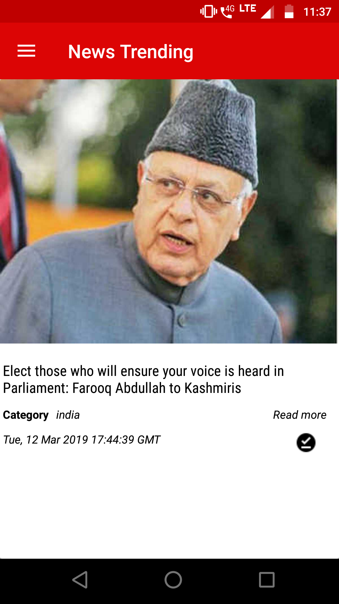
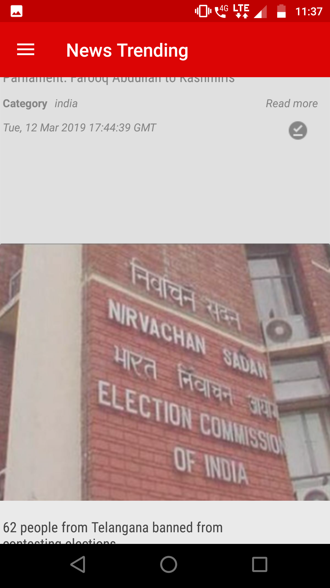
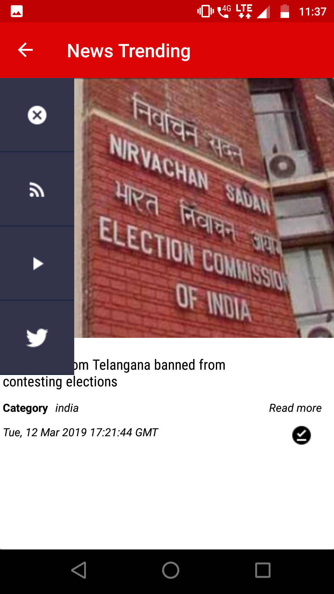
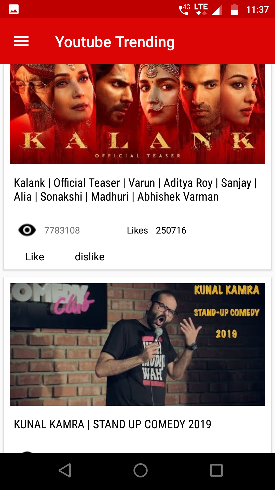
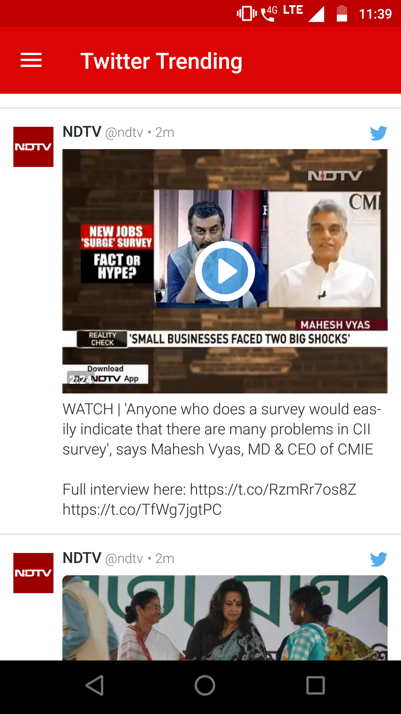
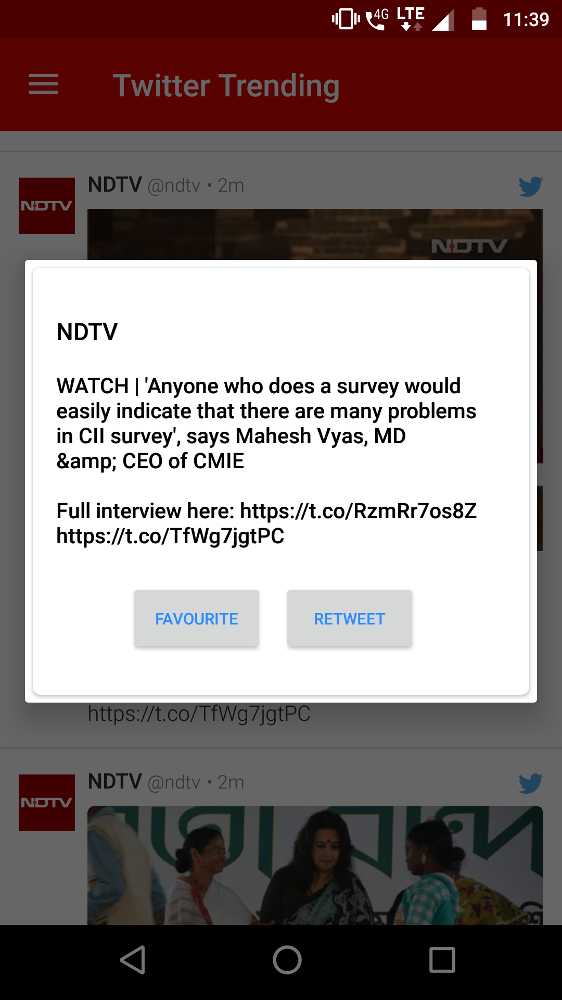

# Multiple Social Media Into Single App
Android app merges 
- Mutliple news into user feed from Times of India , Indian Express and many more news website data , offline functionality to save news , share news on other platform.
- Twitter Feed , mark tweet favourite , retweet option in app iteself. 
- Youtube api v3 integration , Top Trending Videos , Playing them on youtube controller , like / dislike video from app iteself.
- A Beuatiful UI .

###### Home page

###### Home page Scrolling upward direction

###### Side Bar

###### Youtube Top Trending Videos in India

###### Youtube Video Playing

###### Twitter Feed

###### Twitter Feed Tweet / Retweet

